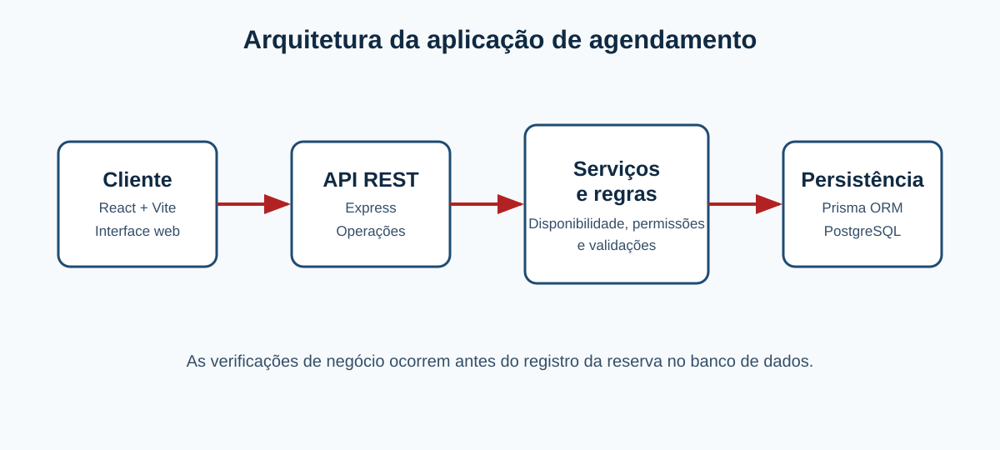
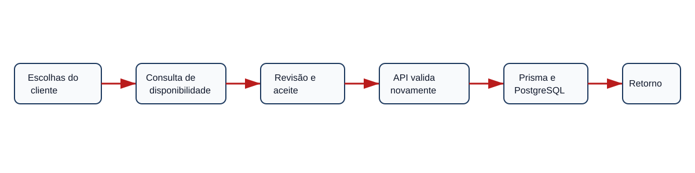
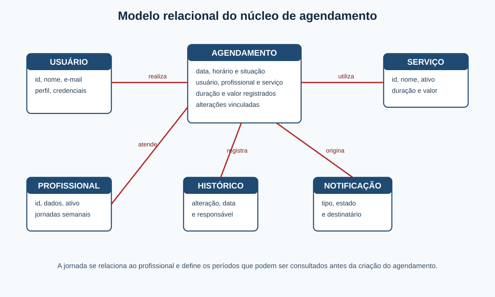

# DESENVOLVIMENTO DE UM SISTEMA WEB PARA AGENDAMENTO E GESTÃO DE HORÁRIOS EM BARBEARIAS

## DEVELOPMENT OF A WEB SYSTEM FOR APPOINTMENT SCHEDULING AND TIME MANAGEMENT IN BARBERSHOPS

**[AUTORIA, FILIAÇÃO E ORCID — PENDENTE DE CONFIRMAÇÃO]**

### Resumo

Pequenas barbearias precisam conciliar a execução dos serviços com a organização da própria agenda. Quando os horários são consultados e registrados por mensagens, anotações ou comunicação direta, o profissional pode interromper o atendimento para responder clientes e ainda enfrentar dificuldade para verificar se determinado período comporta o serviço solicitado. Este trabalho apresenta o desenvolvimento de um sistema web para uma única barbearia, com foco na organização de profissionais, serviços, jornadas e agendamentos. O objetivo foi construir uma solução responsiva que permitisse ao cliente consultar opções de atendimento e concluir uma reserva apenas em horários compatíveis, ao mesmo tempo em que oferecesse instrumentos administrativos para configurar a agenda. O projeto foi conduzido de forma incremental e teve o escopo refinado durante seu desenvolvimento: recursos inicialmente previstos, como pagamentos, produtos e relatórios avançados, foram retirados para priorizar o núcleo de agendamento. A solução divide a jornada dos profissionais em intervalos de trinta minutos e considera a duração de cada serviço, períodos ocupados e alterações de status para apresentar horários válidos. Foram implementados cadastro, autenticação, controle de acesso, gerenciamento de profissionais e serviços, configuração de jornadas, agendamento em etapas, cancelamento, remarcação, histórico e painel administrativo. Testes automatizados verificaram regras de disponibilidade, conflitos, permissões e alterações da agenda. Conclui-se que o sistema atende ao objetivo de organizar reservas e reduzir inconsistências no fluxo de horários, embora permaneçam limitações relativas à cobertura de testes, à validação de integrações externas e à avaliação formal com usuários.

**Palavras-chave:** agendamento. barbearias. sistemas de informação. gestão de horários. desenvolvimento web.

### Abstract

Small barbershops must reconcile service delivery with schedule management. When appointments are handled through messages, notes, or direct communication, professionals may interrupt customer service to answer requests and still face difficulties in determining whether a time period accommodates the requested service. This paper presents the development of a web system for a single barbershop, focused on professionals, services, work schedules, and appointments. The objective was to build a responsive solution that enables customers to consult service options and complete reservations only in compatible time slots while providing administrative instruments to configure the schedule. The project was developed incrementally and its scope was refined: payments, products, and advanced reports were removed to prioritize the scheduling core. The system divides work schedules into thirty-minute intervals and considers service duration, occupied periods, and appointment status to present valid time slots. It includes registration, authentication, access control, management of professionals and services, work-schedule configuration, step-by-step appointment booking, cancellation, rescheduling, history, and an administrative panel. Automated tests verified availability, conflict, permission, and schedule-change rules. The system meets the proposed objective of organizing reservations and reducing inconsistencies, while retaining explicit limitations concerning coverage, external integrations, and formal user evaluation.

**Keywords:** Scheduling. Barbershops. Information systems. Time management. Web development.

## 1 INTRODUÇÃO

Em estabelecimentos de serviços pessoais, a organização do tempo de atendimento é parte do próprio trabalho. Na barbearia, o mesmo profissional pode precisar cortar o cabelo, responder mensagens, consultar a agenda e confirmar a disponibilidade de um novo horário. Quando essas informações ficam distribuídas entre conversas, anotações e memória, torna-se mais difícil recuperar o que já foi marcado e compreender os períodos efetivamente livres.

O problema não se resume a identificar se existe um atendimento em determinado horário. Serviços possuem durações distintas. Um corte simples pode ocupar um período menor que um atendimento combinado; assim, um intervalo aparentemente vazio pode não ser suficiente para o serviço escolhido. Também é necessário considerar a jornada de cada profissional e impedir que duas reservas utilizem o mesmo período.

O presente trabalho teve origem no Projeto Integrador de 2025. O planejamento inicial incluía pagamentos, produtos, assinaturas, fidelidade, relatórios e notificações. Durante o TCC, verificou-se que esse conjunto superava o necessário para uma solução clara e confiável. O escopo foi então delimitado para uma única barbearia e passou a priorizar profissionais, serviços, jornadas e prevenção de conflitos. Essa decisão não representa abandono do projeto, mas refinamento para desenvolver e explicar adequadamente sua funcionalidade central.

A questão de pesquisa é: como desenvolver um sistema web simples e responsivo capaz de organizar os agendamentos de uma barbearia, considerando a jornada dos profissionais, a duração dos serviços e a prevenção de conflitos? O objetivo geral foi desenvolver essa solução. Como objetivos específicos, buscou-se modelar os dados principais, permitir o gerenciamento administrativo, disponibilizar o agendamento ao cliente, calcular horários compatíveis, controlar acessos e validar regras críticas.

Para apresentar o percurso adotado, o artigo reúne a fundamentação que orienta o problema, os materiais e métodos empregados, o desenvolvimento da solução e a discussão dos resultados obtidos.

## 2 DESENVOLVIMENTO

### 2.1 Fundamentação teórica

#### 2.1.1 Sistemas de informação aplicados a pequenos estabelecimentos

Pequenas empresas possuem características próprias de gestão e, em muitos casos, lidam com informações de maneira pouco formalizada. Moraes e Escrivão Filho (2006) destacam que a gestão da informação envolve identificar necessidades, obter, processar, distribuir e utilizar dados; os autores apontam dificuldades dessas organizações em tratar a informação como recurso para decisão. Para um estabelecimento de serviços, a agenda é precisamente uma informação operacional: ela orienta quem atende, quando atende e qual serviço será realizado.

Moraes, Terence e Escrivão Filho (2004) discutem que a tecnologia da informação precisa ser adequada às especificidades das pequenas empresas. Essa perspectiva orientou a escolha por uma solução limitada a uma barbearia, sem mecanismos empresariais desnecessários. O propósito não é prometer ganhos financeiros não medidos, mas centralizar dados necessários ao atendimento e tornar a consulta de horários mais consistente.

#### 2.1.2 Agendamento, disponibilidade e organização de serviços

Uma agenda de serviços precisa relacionar recursos, duração e períodos disponíveis. No sistema proposto, o recurso principal é o profissional. A disponibilidade não é tratada como uma lista fixa de horários: ela depende da jornada previamente definida, do serviço selecionado e dos atendimentos já existentes. Dessa forma, o cliente não recebe apenas uma confirmação posterior; visualiza opções que já passaram por uma verificação inicial de compatibilidade.

Esse entendimento aproxima o agendamento de uma atividade de gestão da informação: cada reserva modifica a situação da agenda e precisa ser considerada nas decisões posteriores. A solução não procura encontrar a combinação matematicamente ótima de todos os atendimentos. Seu propósito é mais delimitado: não oferecer ao cliente um período que não comporte integralmente o serviço escolhido ou que ultrapasse a jornada disponível.

#### 2.1.3 Desenvolvimento web, dados e acessibilidade

A solução foi organizada como aplicação web com interface, operações de servidor, regras de negócio e banco relacional. Essa separação facilita a manutenção porque a tela não decide sozinha se uma reserva é válida. A interface foi construída com componentes React; TypeScript auxiliou a consistência de dados; a API organizou as operações; e o banco relacional preservou relações entre usuários, profissionais, serviços e reservas (REACT, 2026; TYPESCRIPT, 2026; POSTGRESQL GLOBAL DEVELOPMENT GROUP, 2026). O Prisma foi utilizado para manter o modelo de dados e seu histórico de alterações versionados (PRISMA, 2026a; PRISMA, 2026b).

Usabilidade e acessibilidade também foram consideradas na interface por meio de navegação por teclado, atalho para conteúdo principal, mensagens de retorno e recursos de apoio. A WCAG 2.2 orienta acessibilidade para diferentes necessidades e ressalta que a avaliação deve combinar recursos automatizados e análise humana (W3C, 2024). O Modelo de Acessibilidade em Governo Eletrônico também oferece orientação nacional complementar para serviços digitais (BRASIL, 2026). Por isso, o trabalho descreve medidas implementadas, mas não declara conformidade completa.

Em sistemas com dados pessoais e ações administrativas, autenticação e autorização possuem finalidades distintas: a primeira identifica o usuário; a segunda limita o que ele pode fazer. A OWASP recomenda que permissões sejam verificadas em cada solicitação e que o acesso a objetos seja conferido mesmo quando o usuário já esteja autenticado (OWASP, 2026). Essa orientação foi considerada ao restringir o painel e os agendamentos aos perfis e proprietários correspondentes.

Após a apresentação dos conceitos relacionados à gestão da informação, à disponibilidade e à proteção do acesso, a próxima seção descreve como esses princípios foram transformados em requisitos e etapas de desenvolvimento.

### 2.2 Materiais e métodos

O trabalho consistiu em desenvolvimento tecnológico aplicado, conduzido de forma incremental. A descrição do problema, das decisões de método, dos dados e dos limites da avaliação acompanha a necessidade de tornar explícito como uma investigação foi conduzida (CRESWELL; CRESWELL, 2023). Após a definição inicial do problema, foram levantados requisitos de cadastro, jornada, reserva, cancelamento, remarcação e administração. A modelagem reuniu as entidades necessárias para representar usuários, profissionais, serviços, disponibilidade, agendamentos, histórico e configurações. Em seguida, foram construídas telas, operações administrativas e regras de validação.

O levantamento partiu do material do Projeto Integrador, dos requisitos atualizados e da análise do fluxo que deveria permanecer no produto final. Cada requisito foi confrontado com o escopo: funcionalidades que não contribuíam diretamente para organizar horários foram adiadas. A priorização ocorreu em ciclos: primeiro foram estruturados dados e cadastros; depois jornadas e disponibilidade; em seguida, reserva, permissões, alterações e testes. A documentação e o histórico de versões registraram as decisões e permitiram revisar regressões.

Como procedimento de avaliação, foram definidos cenários que representam regras do sistema: reservar horário livre, recusar período incompatível, respeitar duração, liberar período cancelado, impedir acesso indevido e registrar alterações. A qualidade de software envolve, entre outros aspectos, requisitos, testes e critérios de avaliação (ISO, 2011). Neste trabalho, os testes automatizados foram usados para verificar esses cenários; validação com usuários não foi realizada e permanece como limitação.

As tecnologias foram escolhidas como meios para a solução: React e Vite construíram a interface; Express organizou as operações de servidor; TypeScript reduziu incompatibilidades entre dados; PostgreSQL armazenou informações relacionadas; Prisma intermediou aplicação e banco; JWT identificou sessões autenticadas; e Vitest executou testes automatizados. A escolha não teve como finalidade demonstrar uma arquitetura complexa, mas manter responsabilidades compreensíveis para um sistema de escopo limitado.

Quadro 1 — Tecnologias empregadas no sistema

| Camada | Tecnologia | Finalidade no projeto |
| --- | --- | --- |
| Interface | React e Vite | Construção e execução da interface web responsiva |
| Servidor | Express | Disponibilização das operações e aplicação das regras de negócio |
| Linguagem | TypeScript | Consistência na troca e no tratamento dos dados |
| Persistência | PostgreSQL | Armazenamento das informações relacionadas da agenda |
| Mapeamento de dados | Prisma | Intermediação entre a aplicação e o banco de dados |
| Autenticação | JWT | Identificação de sessões autenticadas e apoio ao controle de acesso |
| Testes | Vitest | Execução de verificações automatizadas das regras críticas |

Fonte: Elaborado pelo autor (2026).

Quadro 2 — Decisões arquiteturais do projeto

| Decisão | Justificativa |
| --- | --- |
| Atendimento a uma única barbearia | Delimitar um problema concreto e viabilizar um núcleo funcional verificável |
| Separação entre interface e servidor | Evitar que a tela seja a única responsável por validar reservas |
| Uso de banco relacional | Manter vínculos consistentes entre usuários, profissionais, serviços e agendamentos |
| Jornada em intervalos de trinta minutos | Tornar o cálculo de duração e disponibilidade compreensível e rastreável |
| Revisão antes da confirmação | Permitir ao cliente conferir as escolhas antes de gravar a reserva |
| Autenticação e perfis | Restringir dados e operações administrativas aos usuários autorizados |

Fonte: Elaborado pelo autor (2026).

Os requisitos, as decisões de escopo e as tecnologias apresentadas orientaram a construção da solução descrita a seguir.

### 2.3 Desenvolvimento do sistema

#### 2.3.1 Arquitetura da aplicação

A solução foi organizada em camadas para que a experiência na tela, as decisões sobre a agenda e a persistência dos dados não dependessem de um único componente. O cliente acessa a interface web; as solicitações são recebidas pela API; as regras verificam identidade, permissões, jornada, duração e conflito; por fim, as informações são consultadas ou registradas no banco. Essa organização torna possível aplicar a mesma regra tanto no agendamento do cliente quanto nas operações administrativas.

Conforme apresentado na Figura 1, a interface não se comunica diretamente com o banco de dados. A API funciona como ponto de passagem das operações e evita que uma alteração de tela, por si só, autorize uma reserva incompatível. O uso de serviços de negócio entre a API e a persistência concentra as verificações que precisam ocorrer antes de criar, cancelar ou remarcar um agendamento.

Figura 1 — Arquitetura geral da aplicação

Fonte: Elaborado pelo autor (2026).

O diagrama também evidencia que o Prisma não é uma segunda base de dados: ele auxilia a aplicação a consultar e registrar as informações no PostgreSQL. Essa distinção é relevante para compreender que as relações e restrições dos dados permanecem no banco, enquanto as regras de disponibilidade são avaliadas pela aplicação antes da gravação.

#### 2.3.2 Interface do cliente

O sistema possui uma página inicial que apresenta o serviço de agendamento e orienta o acesso ao fluxo de reserva. A linguagem da interface prioriza ações compreensíveis, como escolher profissional, serviço, data e horário. Essa escolha reduz a necessidade de o cliente conhecer termos internos do sistema e mantém o foco na decisão que precisa tomar a cada etapa.

Conforme será apresentado na Figura 2, a entrada para o agendamento é visível desde a tela inicial. A captura final deverá mostrar a página em estado sem dados pessoais. Além de apresentar o serviço, essa tela oferece acesso ao cadastro e à autenticação, necessários quando o usuário chega à confirmação de uma reserva.

Figura 2 — Página inicial do sistema

[FIGURA PENDENTE — captura atual da página inicial, em resolução adequada e sem dados pessoais.]

Fonte: Elaborado pelo autor (2026).

A interface foi planejada para ser responsiva, isto é, adaptar a organização visual a diferentes larguras de tela. Recursos como foco navegável, mensagens de retorno e atalho ao conteúdo principal foram incorporados como medidas de apoio. Eles não substituem uma auditoria completa de acessibilidade, mas representam cuidados alinhados às diretrizes discutidas na Seção 2.1.3.

#### 2.3.3 Fluxo de agendamento

O agendamento ocorre em etapas. Inicialmente, o cliente seleciona um profissional ou informa não ter preferência. Em seguida, escolhe o serviço e uma data. Somente então a aplicação apresenta horários compatíveis. Depois de escolher um horário, o usuário visualiza uma revisão com profissional, serviço, data, duração e valor; a confirmação exige aceite explícito e autenticação quando necessária.

Conforme apresentado na Figura 3, a seleção do profissional é uma decisão que antecede o cálculo da disponibilidade. Quando existe preferência, a agenda daquele profissional é consultada. Quando não há preferência, o sistema pode buscar um profissional ativo compatível com o período solicitado. Em ambos os casos, a escolha não elimina a verificação posterior de jornada e duração.

Figura 3 — Seleção do profissional no fluxo de agendamento

[FIGURA PENDENTE — captura da etapa de seleção do profissional, incluindo a opção “sem preferência”.]

Fonte: Elaborado pelo autor (2026).

A etapa seguinte apresenta os serviços disponíveis, conforme a Figura 4. Cada serviço possui informações que influenciam o restante do fluxo, especialmente duração e valor. Assim, a tela não é apenas um catálogo: a seleção determina quanto tempo consecutivo a reserva precisará ocupar na agenda.

Figura 4 — Seleção do serviço

[FIGURA PENDENTE — captura da etapa de seleção do serviço.]

Fonte: Elaborado pelo autor (2026).

O encadeamento completo está sintetizado na Figura 5. A representação evidencia que a confirmação não ocorre logo após a escolha do horário: há uma etapa de revisão e, se necessário, autenticação. Ao fim, a disponibilidade é consultada novamente antes do armazenamento, porque um período que estava livre durante a consulta pode ter sido reservado por outra pessoa.

Figura 5 — Fluxo de confirmação do agendamento

Fonte: Elaborado pelo autor (2026).

Antes da gravação, a disponibilidade é verificada novamente. Essa segunda conferência é importante porque outro cliente pode reservar o mesmo período entre a consulta e a confirmação. A aplicação verifica a sobreposição entre os períodos dos atendimentos; o banco aplica uma proteção adicional contra reservas ativas com o mesmo profissional, data e horário inicial. Se a reserva se tornar incompatível, a solicitação é recusada e o cliente precisa escolher outra opção.

#### 2.3.4 Definição da jornada dos profissionais

Cada profissional possui uma jornada semanal configurada em intervalos de trinta minutos. A administração define em quais dias e períodos o profissional pode atender. Essa configuração antecede o agendamento e transforma a rotina do estabelecimento em informação consultável pelo sistema, em vez de depender de uma decisão informal a cada mensagem recebida.

Conforme a Figura 6, a área administrativa permite configurar a jornada de maneira separada dos dados cadastrais do profissional. Essa separação é importante porque uma alteração na escala não exige recriar o cadastro do barbeiro. Também permite que profissionais diferentes possuam horários de atendimento distintos.

Figura 6 — Configuração da jornada de um profissional

[FIGURA PENDENTE — captura da configuração semanal da jornada, sem dados pessoais.]

Fonte: Elaborado pelo autor (2026).

A escolha de intervalos de trinta minutos não significa que todos os serviços tenham a mesma duração. Ela fornece uma unidade simples para representar a disponibilidade. Um serviço de sessenta minutos, por exemplo, exige dois intervalos consecutivos; um serviço mais longo exige a quantidade correspondente de intervalos livres.

#### 2.3.5 Cálculo dos horários disponíveis e regras de negócio

Ao escolher uma data e um serviço, o sistema consulta a jornada aplicável, os agendamentos ativos e a duração selecionada. Conforme a Figura 7, o calendário aparece antes dos horários: o cliente escolhe o dia e visualiza apenas as opções disponíveis para ele. Não basta que o horário inicial esteja livre; todo o tempo necessário para o serviço deve permanecer livre dentro da jornada.

Figura 7 — Calendário e horários disponíveis

[FIGURA PENDENTE — captura da etapa de data e horários disponíveis, com um serviço selecionado.]

Fonte: Elaborado pelo autor (2026).

Essa estratégia reduz a oferta de horários que não comportam integralmente o serviço escolhido e impede que uma reserva ultrapasse períodos indisponíveis. Ela não elimina todos os pequenos intervalos entre atendimentos nem realiza otimização global da agenda. Seu resultado esperado é mais específico: impedir uma reserva incompatível com a duração, a jornada e os períodos já ocupados.

Quadro 3 — Regras de negócio verificadas no sistema

| Regra | Descrição |
| --- | --- |
| RN01 | Apenas usuários autenticados podem concluir a criação de agendamentos. |
| RN02 | Apenas administradores acessam funções de gerenciamento administrativo. |
| RN03 | O horário escolhido precisa estar dentro da jornada do profissional. |
| RN04 | O serviço precisa caber integralmente no período disponível. |
| RN05 | Não pode haver sobreposição entre agendamentos ativos do mesmo profissional. |
| RN06 | O cancelamento deixa de bloquear o período e permite nova consulta de disponibilidade. |
| RN07 | A remarcação executa novamente as validações de disponibilidade. |

Fonte: Elaborado pelo autor (2026).

O Quadro 3 sintetiza as regras que conectam a interface ao comportamento esperado. A apresentação dessas regras também orientou os cenários de teste discutidos na Seção 2.4, pois uma tela visualmente concluída não é suficiente se permitir uma reserva incompatível.

#### 2.3.6 Revisão, confirmação, cancelamento e remarcação

Depois de escolher o horário, o cliente recebe uma revisão das informações. Conforme a Figura 8, essa etapa reúne profissional, serviço, data, horário, duração e valor, permitindo identificar um erro antes da confirmação. O aceite explícito impede que a reserva seja criada somente pela seleção de um horário, comportamento que poderia surpreender o usuário e dificultar a correção.

Figura 8 — Revisão e confirmação do agendamento

[FIGURA PENDENTE — captura da revisão, do aceite e da ação de confirmar.]

Fonte: Elaborado pelo autor (2026).

Após a confirmação, o cliente pode consultar seus próprios agendamentos, conforme a Figura 9. O histórico permite acompanhar a situação da reserva e disponibiliza cancelamento ou remarcação quando o prazo configurado permite. A remarcação não é tratada como edição livre de uma reserva existente: ela volta a consultar data, jornada e disponibilidade antes de registrar a alteração, preservando o histórico do processo.

Figura 9 — Área e histórico de agendamentos do cliente

[FIGURA PENDENTE — captura da área do cliente com ações de cancelamento ou remarcação.]

Fonte: Elaborado pelo autor (2026).

Essas etapas mantêm o cliente informado sobre o que foi escolhido e evitam que ações posteriores contornem a validação utilizada na criação inicial. A próxima subseção apresenta os recursos destinados ao responsável pela agenda.

#### 2.3.7 Área administrativa

A área administrativa reúne o cadastro de serviços, profissionais e usuários, a configuração da jornada, a agenda e os estados dos atendimentos. O administrador prepara as condições que sustentam a reserva pública: ativa profissionais, registra os serviços oferecidos, informa duração e valor e define a jornada de cada profissional.

Conforme a Figura 10, o painel organiza o acesso a essas funções sem expor suas operações ao perfil de cliente. Essa separação atende tanto à necessidade de organização do estabelecimento quanto ao princípio de limitar operações conforme a função do usuário. A tela final deverá utilizar dados demonstrativos para não divulgar informações pessoais.

Figura 10 — Painel administrativo

[FIGURA PENDENTE — captura do painel administrativo com dados demonstrativos.]

Fonte: Elaborado pelo autor (2026).

A agenda administrativa, ilustrada na Figura 11, permite visualizar e acompanhar os estados das reservas. Esse recurso não substitui o cálculo de disponibilidade feito no agendamento; ele oferece ao responsável uma visão consolidada para acompanhar pendências, confirmações, atendimentos concluídos, cancelados ou atrasados e tomar decisões operacionais.

Figura 11 — Agenda administrativa

[FIGURA PENDENTE — captura da agenda administrativa com dados demonstrativos.]

Fonte: Elaborado pelo autor (2026).

#### 2.3.8 Segurança, autenticação e controle de acesso

O sistema diferencia usuário autenticado de usuário autorizado. A autenticação identifica quem está realizando uma ação; a autorização avalia se aquele perfil pode acessar determinado recurso. Assim, o cliente pode visualizar e administrar seus próprios agendamentos, mas não cadastrar profissionais ou consultar a agenda completa da barbearia. O administrador, por sua vez, utiliza funções próprias de gerenciamento.

O token de autenticação é utilizado pela aplicação para identificar a sessão, mas ele não dispensa validações no servidor. Nas operações que envolvem um agendamento, também é verificado se o usuário é proprietário daquela reserva ou possui perfil administrativo. Essa medida reduz a possibilidade de uma pessoa alterar dados que não lhe pertencem e materializa, na solução, a distinção conceitual discutida na Seção 2.1.3.

#### 2.3.9 Estrutura do banco de dados

O modelo relacional representa os dados necessários para preservar o vínculo entre a pessoa atendida, o profissional responsável, o serviço e o período reservado. Conforme apresentado na Figura 12, a entidade Usuário representa clientes e administradores. A entidade Profissional registra os dados dos barbeiros e se relaciona à jornada semanal, que informa em quais períodos eles podem atender.

Figura 12 — Modelo relacional do núcleo de agendamento

Fonte: Elaborado pelo autor (2026).

A entidade Serviço armazena, entre outras informações, duração e valor. Esses atributos são utilizados tanto para apresentar a opção ao cliente quanto para determinar o espaço necessário na agenda. A entidade Agendamento centraliza a relação entre usuário, profissional e serviço, registrando data, horário e situação do atendimento. Histórico e notificações complementam o acompanhamento das alterações e comunicações, sem substituir a reserva principal.

O modelo também separa disponibilidade e agendamento. A jornada define uma condição geral de atendimento; o agendamento registra uma ocupação específica. Essa separação permite que a aplicação consulte primeiro a rotina do profissional e, depois, desconte os períodos ocupados. A estrutura de dados apresentada sustenta os resultados e cenários discutidos na seção seguinte.

#### 2.3.10 Notificações e integrações externas

Foram estruturadas integrações para notificações por WhatsApp e autenticação por Google. Entretanto, ambas dependem de credenciais, serviços externos e configuração que não foram comprovados em ambiente de produção. Por esse motivo, são classificadas como recursos parciais: a estrutura existe no projeto, mas não deve ser apresentada como resultado integralmente validado.

Com a arquitetura, as telas e as regras descritas, a próxima seção analisa o que foi efetivamente obtido e quais evidências sustentam o funcionamento observado.

### 2.4 Resultados e discussão

#### 2.4.1 Funcionalidades obtidas

O resultado principal é um fluxo em que o cliente consegue iniciar uma reserva, consultar opções compatíveis, revisar suas escolhas e confirmar o atendimento. Em vez de o profissional precisar responder individualmente se há horário, o sistema combina as informações cadastradas e apresenta uma possibilidade compatível com a seleção feita pelo cliente. A contribuição prática não é substituir toda a gestão do estabelecimento, mas centralizar a regra essencial de disponibilidade em um único fluxo.

O fluxo também evidencia a diferença entre a consulta de um horário e a confirmação de uma reserva. A interface permite explorar opções de data e serviço; a reserva somente é criada quando o usuário revisa os dados, aceita a confirmação, autentica-se quando necessário e a disponibilidade é conferida novamente. Essa sequência torna a ação mais transparente e reduz o risco de uma criação involuntária ao apenas selecionar um horário.

Na área do cliente, a consulta dos próprios agendamentos permite acompanhar o estado da reserva e solicitar cancelamento ou remarcação quando a antecedência configurada permite. Na administração, a configuração de jornada antecede a oferta dos horários, permitindo que o responsável adapte a agenda à rotina de cada profissional. Assim, as telas apresentadas na Seção 2.3 não são elementos isolados: elas compõem uma cadeia em que cadastros e jornada condicionam o que o cliente poderá reservar.

Quadro 4 — Requisitos atendidos no sistema final

| Requisito | Situação |
| --- | --- |
| Cadastro de profissionais | Implementado |
| Cadastro de serviços | Implementado |
| Agendamento em etapas | Implementado |
| Jornada de profissionais | Implementado |
| Cálculo de horários compatíveis | Implementado |
| Cancelamento e remarcação | Implementados |
| Área administrativa | Implementada |
| Histórico de alterações | Implementado |
| Notificações por WhatsApp | Parcial — requer configuração externa e validação |
| Login por Google | Parcial — requer configuração externa e validação |
| Pagamentos, produtos e fidelidade | Não implementados no escopo final |

Fonte: Elaborado pelo autor (2026).

O Quadro 4 distingue o que foi entregue daquilo que permaneceu parcial ou fora do recorte. Essa delimitação é importante para que o resultado seja interpretado de forma fiel, sem atribuir ao sistema funcionalidades planejadas, mas não concluídas.

#### 2.4.2 Validação das regras de agendamento

Os comportamentos observados na solução correspondem às regras definidas no Quadro 3. Quando o horário está livre e dentro da jornada, a reserva pode prosseguir. Quando o serviço ultrapassa o período disponível, a opção não deve ser apresentada. Quando há ocupação incompatível, a solicitação é recusada. O cancelamento altera o estado da reserva e permite que o período volte a ser considerado em uma consulta posterior; a remarcação retorna ao cálculo de disponibilidade em vez de apenas trocar a data no registro existente.

O resultado da opção sem preferência amplia a conveniência sem abandonar a regra de disponibilidade. Quando o cliente não seleciona um profissional específico, o sistema procura um profissional ativo que consiga atender no período solicitado. Portanto, essa escolha não autoriza reservas fora da jornada nem sobreposições: ela apenas permite que a aplicação encontre uma alternativa entre os profissionais cadastrados.

Quadro 5 — Cenários de teste e comportamento obtido

| Cenário | Comportamento esperado | Resultado obtido |
| --- | --- | --- |
| Horário já ocupado | Rejeitar nova reserva incompatível | Confirmado nos testes automatizados |
| Horário livre dentro da jornada | Permitir o prosseguimento da reserva | Confirmado nos testes automatizados |
| Serviço ultrapassa a jornada | Não disponibilizar ou não confirmar o período | Confirmado nos testes automatizados |
| Usuário comum acessa área administrativa | Negar acesso à operação administrativa | Confirmado nos testes automatizados |
| Cancelamento | Atualizar o estado e liberar nova consulta do período | Confirmado nos testes automatizados |
| Remarcação | Validar novamente a disponibilidade antes da alteração | Confirmado nos testes automatizados |

Fonte: Elaborado pelo autor (2026).

Os cenários não demonstram que a agenda atinge uma distribuição matematicamente ótima de atendimentos, pois essa não foi uma meta do projeto. Eles demonstram que o sistema aplica as condições essenciais para não confirmar uma reserva que exceda a jornada, a duração necessária ou os períodos ocupados. Essa distinção torna a discussão mais compatível com o escopo definido na introdução.

#### 2.4.3 Resultados dos testes

Na última execução, 129 testes automatizados foram aprovados, sendo 55 relacionados à aplicação cliente e 74 ao servidor. Os testes verificaram criação de reservas, rejeição de horários indisponíveis, duração dos serviços, seleção sem preferência, permissões, cancelamento, remarcação e histórico. Eles funcionam como evidência repetível de que cenários críticos continuam apresentando o comportamento esperado depois de alterações no sistema.

Entretanto, testes automatizados não substituem a observação de uso em situação real. Eles não medem, por exemplo, se um cliente compreende imediatamente uma mensagem da interface ou se um administrador considera a configuração de jornada suficientemente simples. A ausência de avaliação formal com usuários limita as conclusões sobre experiência de uso, apesar das medidas de usabilidade e responsividade implementadas.

A cobertura de código ficou abaixo da meta interna de 80%, e a execução de testes de integração com PostgreSQL depende de um ambiente local que estava indisponível na última verificação. Dessa forma, os testes apresentados validam uma parte relevante das regras unitárias, mas não permitem declarar validação completa de todos os fluxos integrados. Registrar esse limite é coerente com a recomendação de tratar qualidade como conjunto de evidências, e não como resultado de uma única métrica (ISO, 2011).

#### 2.4.4 Evolução entre o planejamento inicial e o sistema final

O refinamento de escopo foi decisivo para o resultado. O planejamento do Projeto Integrador de 2025 incluía uma plataforma mais ampla, com pagamentos, produtos, assinaturas, fidelidade, relatórios e notificações. Durante o desenvolvimento do TCC, concluiu-se que a ampliação simultânea desses recursos reduziria a capacidade de testar e explicar adequadamente o núcleo de agendamento. A solução final concentrou-se, portanto, no problema mais diretamente relacionado à organização da agenda.

Quadro 6 — Comparação entre o planejamento inicial e o sistema final

| Aspecto | Projeto Integrador (2025) | Sistema final do TCC |
| --- | --- | --- |
| Escopo | Plataforma ampla para barbearia | Sistema para uma única barbearia, centrado na agenda |
| Pagamentos | Planejados | Não implementados |
| Produtos e estoque | Planejados | Não implementados |
| Fidelidade e assinaturas | Planejadas | Não implementadas |
| Relatórios avançados | Planejados | Não implementados |
| Agendamento | Planejado | Implementado em etapas |
| Jornada de profissionais | Planejada | Implementada em intervalos de trinta minutos |
| Administração | Parcialmente prevista | Implementada para cadastros, jornada e agenda |
| Testes | Poucos no estágio inicial | 129 testes automatizados aprovados na última execução |

Fonte: Elaborado pelo autor (2026).

O Quadro 6 não representa uma perda de qualidade. Ele demonstra uma decisão de engenharia: reduzir o número de módulos para concluir um conjunto menor de regras com rastreabilidade entre requisito, implementação, teste e documentação. A discussão de pequenas empresas e gestão da informação apresentada por Moraes e Escrivão Filho (2006) reforça a pertinência de uma solução voltada ao uso operacional essencial, sem introduzir recursos cujo benefício não foi investigado neste trabalho.

#### 2.4.5 Limitações observadas

As principais limitações concentram-se em validação e integração. A cobertura automatizada permanece abaixo da meta de 80%; os testes de integração com PostgreSQL não foram concluídos na última execução porque o ambiente Docker local estava indisponível; e não foram realizados testes formais com usuários. Também não houve auditoria completa de acessibilidade nem implantação pública comprovada.

As integrações de WhatsApp e Google dependem de configuração externa e não foram validadas como recursos de produção. Por fim, não foram coletadas métricas financeiras ou de redução de tempo de atendimento, de modo que o trabalho não afirma ganhos econômicos. Essas limitações indicam trabalhos futuros: ampliar cenários integrados, executar avaliação com clientes e administradores, realizar auditoria de acessibilidade e validar as integrações em ambiente controlado.

Os resultados indicam que o núcleo proposto foi alcançado dentro do recorte adotado. A seção final retoma a resposta à questão de pesquisa e sintetiza os aprendizados decorrentes do desenvolvimento.

## 3 CONSIDERAÇÕES FINAIS

O sistema desenvolvido demonstra uma forma de organizar agendamentos para uma única barbearia, considerando que serviços diferentes exigem tempos diferentes e que o profissional precisa ter jornada disponível para atendê-los. A questão de pesquisa foi respondida por meio de um fluxo que apresenta horários compatíveis, exige revisão antes da confirmação e verifica novamente a reserva antes de armazená-la.

Foram alcançados os objetivos ligados ao núcleo de agendamento, à administração e ao controle de acesso. A principal contribuição do trabalho está no refinamento consciente do escopo e na transformação de regras de agenda em comportamento verificável pela aplicação. Como continuidade, recomendam-se ampliar os testes, executar a integração completa em banco isolado, avaliar acessibilidade e experiência com usuários, validar integrações externas e, somente então, avaliar recursos adicionais.

Além da implementação do sistema, o desenvolvimento deste trabalho permitiu consolidar conhecimentos relacionados à engenharia de software, modelagem de banco de dados, arquitetura cliente-servidor, testes automatizados e documentação técnica. O percurso demonstra que o refinamento contínuo do escopo é determinante para entregar uma solução funcional, compreensível e consistente, especialmente quando se busca resolver com profundidade um problema operacional delimitado.

## AGRADECIMENTOS
[PENDENTE DE CONFIRMAÇÃO PELO AUTOR]

## FINANCIAMENTO
[PENDENTE DE CONFIRMAÇÃO PELO AUTOR]

## CONFLITO DE INTERESSES
[PENDENTE DE CONFIRMAÇÃO PELO AUTOR]

## CONTRIBUIÇÕES DOS AUTORES
[PENDENTE DE CONFIRMAÇÃO PELO AUTOR]

## REFERÊNCIAS

MORAES, Giseli Diniz de Almeida; ESCRIVÃO FILHO, Edmundo. A gestão da informação diante das especificidades das pequenas empresas. **Ciência da Informação**, v. 35, n. 3, p. 124-132, 2006. DOI: https://doi.org/10.1590/S0100-19652006000300012.

MORAES, Giseli Diniz de Almeida; TERENCE, Ana Cláudia Fernandes; ESCRIVÃO FILHO, Edmundo. A tecnologia da informação como suporte à gestão estratégica da informação na pequena empresa. **Journal of Information Systems and Technology Management**, v. 1, n. 1, p. 27-43, 2004. DOI: https://doi.org/10.4301/S1807-17752004000100003.

PRISMA. **Prisma ORM**. Disponível em: <https://www.prisma.io/docs/orm>. Acesso em: 2 ago. 2026a.

PRISMA. **Migration histories**. Disponível em: <https://www.prisma.io/docs/orm/prisma-migrate/understanding-prisma-migrate/migration-histories>. Acesso em: 2 ago. 2026b.

WORLD WIDE WEB CONSORTIUM. **Web Content Accessibility Guidelines (WCAG) 2.2**. 2024. Disponível em: <https://www.w3.org/TR/WCAG22/>. Acesso em: 2 ago. 2026.

OWASP. **Authorization Cheat Sheet**. 2026. Disponível em: <https://cheatsheetseries.owasp.org/cheatsheets/Authorization_Cheat_Sheet.html>. Acesso em: 2 ago. 2026.

ISO. **ISO/IEC 25010:2011: Systems and software engineering — Systems and software Quality Requirements and Evaluation**. 2011. Disponível em: <https://www.iso.org/standard/35733.html>. Acesso em: 2 ago. 2026.

CRESWELL, John W.; CRESWELL, J. David. **Research design: qualitative, quantitative, and mixed methods approaches**. 6. ed. Thousand Oaks: SAGE, 2023.

REACT. **Learn React**. Disponível em: <https://react.dev/learn>. Acesso em: 2 ago. 2026.

TYPESCRIPT. **The TypeScript Handbook**. Disponível em: <https://www.typescriptlang.org/docs/handbook/intro>. Acesso em: 2 ago. 2026.

POSTGRESQL GLOBAL DEVELOPMENT GROUP. **PostgreSQL documentation: data definition**. Disponível em: <https://www.postgresql.org/docs/current/ddl.html>. Acesso em: 2 ago. 2026.

BRASIL. Ministério da Gestão e da Inovação em Serviços Públicos. **Modelo de Acessibilidade em Governo Eletrônico (eMAG)**. Disponível em: <https://www.gov.br/governodigital/pt-br/acessibilidade-e-usuario/acessibilidade-digital/modelo-de-acessibilidade>. Acesso em: 2 ago. 2026.
