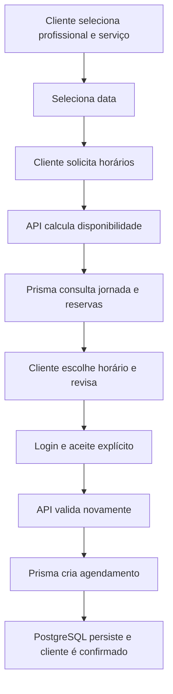
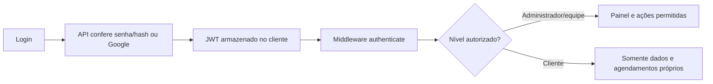
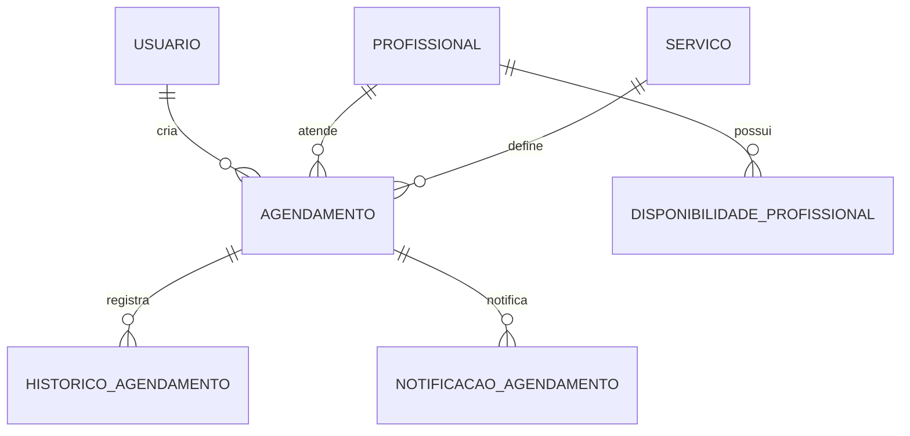
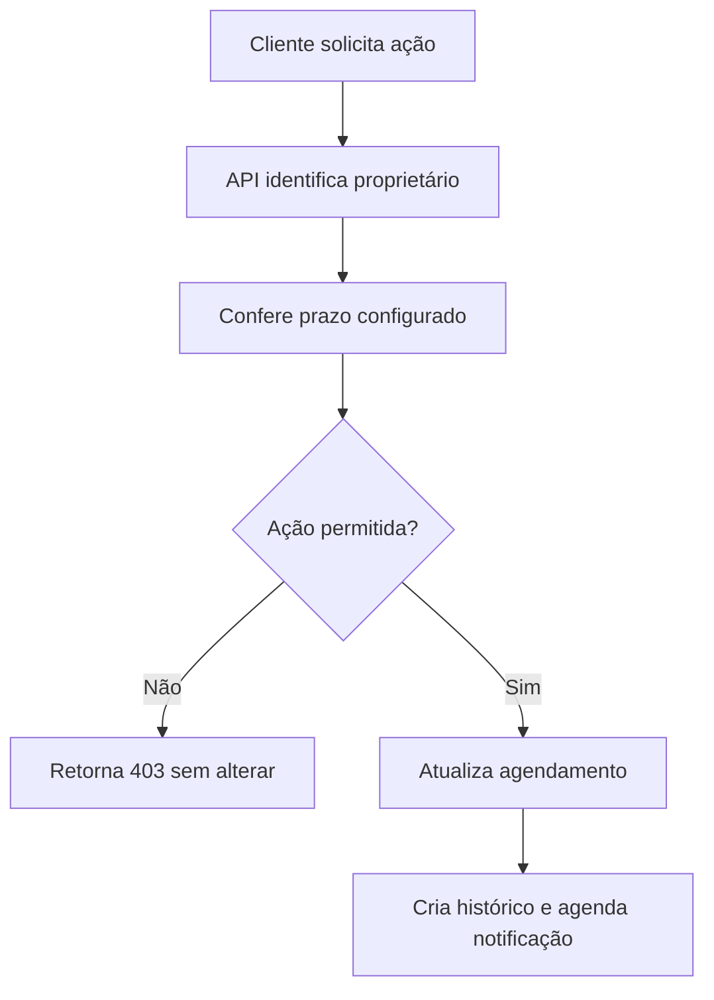

# Mapa de fluxos

## Agendamento

```mermaid
flowchart TD
  A[Cliente seleciona profissional e serviço] --> B[Seleciona data]
  B --> C[Cliente solicita horários]
  C --> D[API calcula disponibilidade]
  D --> E[Prisma consulta jornada e reservas]
  E --> F[Cliente escolhe horário e revisa]
  F --> G[Login e aceite explícito]
  G --> H[API valida novamente]
  H --> I[Prisma cria agendamento]
  I --> J[PostgreSQL persiste e cliente é confirmado]
```

## Autenticação e painel

```mermaid
flowchart LR
  A[Login] --> B[API confere senha/hash ou Google]
  B --> C[JWT armazenado no cliente]
  C --> D[Middleware authenticate]
  D --> E{Nível autorizado?}
  E -->|Administrador/equipe| F[Painel e ações permitidas]
  E -->|Cliente| G[Somente dados e agendamentos próprios]
```

## Dados principais

```mermaid
erDiagram
  USUARIO ||--o{ AGENDAMENTO : cria
  PROFISSIONAL ||--o{ AGENDAMENTO : atende
  SERVICO ||--o{ AGENDAMENTO : define
  PROFISSIONAL ||--o{ DISPONIBILIDADE_PROFISSIONAL : possui
  AGENDAMENTO ||--o{ HISTORICO_AGENDAMENTO : registra
  AGENDAMENTO ||--o{ NOTIFICACAO_AGENDAMENTO : notifica
```

## Cancelamento ou remarcação

```mermaid
flowchart TD
  A[Cliente solicita ação] --> B[API identifica proprietário]
  B --> C[Confere prazo configurado]
  C --> D{Ação permitida?}
  D -->|Não| E[Retorna 403 sem alterar]
  D -->|Sim| F[Atualiza agendamento]
  F --> G[Cria histórico e agenda notificação]
```
